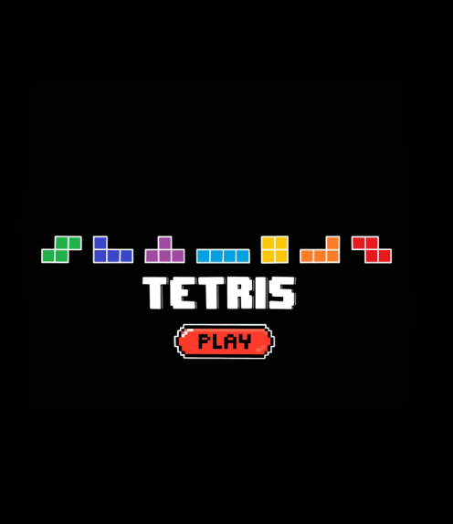

<div id="top"></div>

<!-- PROJECT LOGO -->
<br />
<div align="center">
  </a>
    
  </a>

  <h3 align="center">PROYECTO PROGRAMACIÓN I (S1 2022)</h3>

  <p align="center">
    Tetris en C (SDL2)
    <br />
  </p>
</div>

<!-- TABLE OF CONTENTS -->
<details>
  <summary>Tabla de contenidos</summary>
  <ol>
    <li>
      <a href="#sobre-el-proyecto">Sobre el proyecto</a>
    </li>
	<li><a href="#objetivos">Objetivos</a></li>
    <li>
      <a href="#instrucciones">Instrucciones</a>
      <ul>
        <li><a href="#prerequisitos">Prerequisitos</a></li>
        <li><a href="#instalación">Instalación</a></li>
		<li><a href="#controles">Controles</a></li>
      </ul>
    </li>
    <li><a href="#links-utiles">Links utiles</a></li>
  </ol>
</details>

<p align="right">(<a href="#top">volver a inicio</a>)</p>

<!-- ABOUT THE PROJECT -->
## Sobre el proyecto
### Equipo
* Alonso Bustos (Adodo)
* Franchesca Mora (Franchesita)
* Cristobal Figueroa (Krozz)

### Fechas Importantes
* **Entrega 1:** 24 junio
* **Entrega 2:** 8 julio
* **Entrega final:** 17-21 de julio

Leer `Pauta Proyecto Tetris.pdf` por cualquier duda :)

<p align="right">(<a href="#top">volver a inicio</a>)</p>

<!-- ROADMAP -->
## Objetivos

- [x] ~~***Crear ventana y mover el cubo***~~

- [ ] **Implementar sistema de menús**
    - [ ] Pantalla de Start
    - [ ] Configuración <sub>(Opcional)</sub>
    - [ ] Mayores puntuaciones  <sub>(Opcional)</sub>

- [ ] ***Crear campo de juego (grilla 16x10) y mover piezas en esta***
    - [ ] **Definir limites de movimiento en la grilla**
    - [ ] **Game Over! (Si una pieza sobrepasa el campo de juego)**

- [ ] ***Implementar los 7 tetrominos***
    - [ ] **Rotaciones**
     - [ ] ["Super rotation system"](https://tetris.wiki/Super_Rotation_System)
     - [ ] ["Wall kicks"](https://tetris.wiki/Super_Rotation_System#Wall_Kicks)
    - [ ] **Mostrar la siguiente pieza en la secuencia**
    - [ ] **Elimininar Lineas completadas**
    - [ ] **Usar ["Random generator"](https://www.educative.io/courses/game-development-js-tetris/xlKZA7B9lLr) para crear la secuencia de piezas**
    - [ ] Preview de donde caera la pieza

- [ ] ***Definir los [controles finales](https://strategywiki.org/wiki/Tetris/Controls)***
    - [ ] DAS (Delayed Auto-Shift) y tipos de drops (Soft drop y Hard drop)

- [ ] ***Duracion de juego "infinita"***

- [ ] ***Sistema de Puntuación ["Scoring"](https://tetris.wiki/Scoring)***
    - [ ] **Contador de puntuación en pantalla**
    - [ ] **Contador de lineas completadas**
    - [ ] Implementar velocidades y dificultad
    - [ ] Cambiar escenarios segun puntuacion <sub>(Opcional)</sub>

- [ ] Retoques finales
    - [ ] Solucionar bugs
    - [ ] Musiquita! _(Loo-fi estilo tetris - Doom estilo tetris)_ <sub>(Opcional)</sub>
    - [ ] ***Ser el mejor tetris en C del mundo >:)***

<p align="right">(<a href="#top">volver a inicio</a>)</p>

<!-- GETTING STARTED -->
## Instrucciones

Aqui dar instrucciones de como montar el repositorio localmente y como compilar el juego, ademas de como jugarlo

### Prerequisitos

~~Ser vio pa la wea~~
Dependencias para poder compilar

* SDL2: Instalación en ubuntu
  ```
  sudo apt-get install libsdl2-2.0
  ```
* SDL2_image: Instalación en ubuntu
  ```
  sudo apt-get install libsdl-image1.2-dev
  ```

### Instalación

1. Descargar el repositorio
2. Ir a la carpeta del repositorio desde el terminal
   ```
   cd ../Proyecto-Tetris/
   ```
3. Usar make en "nombre_archivo".c
   ```sh
   make SRCS="nombre_archivo".c
   ```
4. Una vez compilado abrir con
   ```
   ./tetris.exe
   ```
 5. Have fun :)

### Controles

En menús:
* <kbd>↑</kbd>, <kbd>↓</kbd>, <kbd>←</kbd> y <kbd>→</kbd>: Moverse por el menú
* <kbd>ENTER</kbd> y <kbd>ESPACIO</kbd>: Confirmar
* <kbd>ESC</kbd>: Salir del juego

En partida:
* <kbd>←</kbd> y <kbd>→</kbd>: Mover el tetrominó
* <kbd>ESPACIO</kbd> o <kbd>↓</kbd>: Drop  instantáneo/rapido del tetrominó
* <kbd>X</kbd> o <kbd>Z</kbd>: Rotar 90° (sentido horario o antihorario) el tetrominó
* <kbd>A</kbd>: Rotar 180° el tetrominó
* <kbd>C</kbd>: Guardar pieza
* <kbd>ESC</kbd>: Pausar
* <kbd>R</kbd>: Reinciar

<p align="right">(<a href="#top">volver a inicio</a>)</p>

<!-- ACKNOWLEDGMENTS -->
## Links utiles

Aqui pondremos links utiles para el proyecto, ya sea documentacion de SDL2 o ideas para programar Tetris

* [Documentación SDL2 (Wiki)](https://wiki.libsdl.org/)
* [Wiki SDL2 por categorias](https://wiki.libsdl.org/APIByCategory)
* [Seminario de un tipo de Harvard que explica de pana el SDL (esta en español](https://youtu.be/yFLa3ln16w0)
* [Tutorial para hacer un menú bomnito con SDL](https://www.parallelrealities.co.uk/tutorials/widgets/widgets1.php)
* [Gameplay general Tetris](https://tetris.wiki/Gameplay_of_Tetris)[Categorias del Gameplay](https://tetris.wiki/Category:Gameplay)
* [Generacion de piezas](https://tetris.wiki/Category:Gameplay)[Implementación](https://www.educative.io/courses/game-development-js-tetris/xlKZA7B9lLr)
* [Sistema de puntuación en Tetris (Scoring)](https://tetris.wiki/Scoring)
* [Controles generales](https://strategywiki.org/wiki/Tetris/Controls)
* [Sistema de rotaciones "Super rotation system"](https://tetris.wiki/Super_Rotation_System)

Sobre github
* [Readme formatos y syntaxis](https://docs.github.com/en/get-started/writing-on-github/getting-started-with-writing-and-formatting-on-github/basic-writing-and-formatting-syntax)
* [Video funcionamiento de github](https://youtu.be/8Dd7KRpKeaE)
